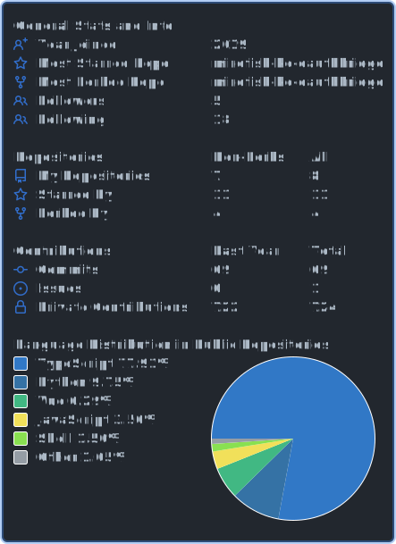

<div align="center">


[](https://git.io/typing-svg)

[](https://github.com/kochangbok?tab=followers)
[](https://github.com/kochangbok?tab=repositories)
[](https://github.com/kochangbok)
[](https://tokscale.ai/u/kochangbok)

</div>

## Learning in Public

I’m still pretty new to coding, and I learn best by building small, practical things.

Right now I’m exploring:
- 🤖 AI-assisted coding and agent workflows
- 🌏 translation and localization tooling
- 🧰 simple browser tools, CLIs, and automation helpers
- 📦 projects that solve repetitive problems in a direct way

<details open>
<summary><b>Tools I'm exploring</b></summary>
<br />
<div align="center">


</div>
</details>

## Retro Corner

<div align="center">

<table>
<tr>
<td width="50%" align="center" valign="top">

<b>Guestbook vibe</b>

<br />
<sub>A tiny old-web nod: if you stop by, feel free to say hi.</sub>

<br /><br />

<a href="https://github.com/kochangbok/kochangbok/issues/new?title=Guestbook%20hello&body=Hi%20George!%20I%20stopped%20by%20your%20profile.">
  
</a>

</td>
<td width="50%" align="center" valign="top">

<b>Tiny web note</b>

<br />
<sub>I like a little retro-web energy as long as the projects stay real.</sub>

<br /><br />


</td>
</tr>
</table>

<pre>
+---------------------------------------+
| hello traveler 👋                     |
| i'm learning in public and building   |
| small tools that solve real problems. |
+---------------------------------------+
</pre>

</div>

## Current Signals

<table>
<tr>
<td width="52%" valign="top">

### 📊 AI Usage

[](https://tokscale.ai/u/kochangbok)

<sub>Public token and cost profile powered by Tokscale.</sub>

</td>
<td width="48%" valign="top">

### 🧭 GitHub Telemetry

[](https://github.com/cicirello/user-statistician)

<sub>Repo-generated GitHub summary card for stability.</sub>

</td>
</tr>
</table>

## Things I'm Building

| Project | What it is | Why I care |
| --- | --- | --- |
| [translator-render](https://github.com/kochangbok/translator-render) | LLM reader-mode translation Chrome extension | I want translation to feel more natural and usable in everyday browsing |
| [MiroFish](https://github.com/kochangbok/MiroFish) | Swarm-intelligence experiment engine | A place to learn by trying ideas, not just reading about them |
| [mirofish-ko-oauthbridge](https://github.com/kochangbok/mirofish-ko-oauthbridge) | OAuth bridge for Korean MiroFish flows | Integration work that makes experiments easier to connect |
| [paperclip-ko](https://github.com/kochangbok/paperclip-ko) | Korean localization work for Paperclip UI | Localization feels like product quality, not just translation |
| [coupang-skill-linux](https://github.com/kochangbok/coupang-skill-linux) | Linux/OpenClaw-ready skill CLI | A small practical utility for a specific workflow |
| [superset-setter](https://github.com/kochangbok/superset-setter) | Tiny setup helper | I like tools that save even a few repeated steps |

<details>
<summary><b>How I’m trying to learn</b></summary>
<br />

```text
01. learn by shipping instead of waiting to feel ready
02. keep projects small enough to finish
03. automate boring steps whenever possible
04. write things clearly so future-me can understand them
05. improve a little by making the next version better than the last
```

</details>

## Activity

<div align="center">

[](https://github.com/ashutosh00710/github-readme-activity-graph)

</div>

## Contribution Snake

<div align="center">

<picture>
  <source media="(prefers-color-scheme: dark)" srcset="https://raw.githubusercontent.com/kochangbok/kochangbok/output/github-contribution-grid-snake-dark.svg" />
  <source media="(prefers-color-scheme: light)" srcset="https://raw.githubusercontent.com/kochangbok/kochangbok/output/github-contribution-grid-snake.svg" />
  
</picture>

</div>

## Current Focus

```text
🌱 Learning       Coding by building real things
🤖 Exploring      AI-assisted workflows and automation
🧰 Building       Small tools that solve repetitive problems
⚡ Goal           Get a little better by shipping consistently
```

## Connect

<div align="center">

[](https://github.com/kochangbok)
[](https://tokscale.ai/u/kochangbok)

</div>

---

<div align="center">

*Learning in public, building useful things, and getting a little better each time.*

<br />


</div>
